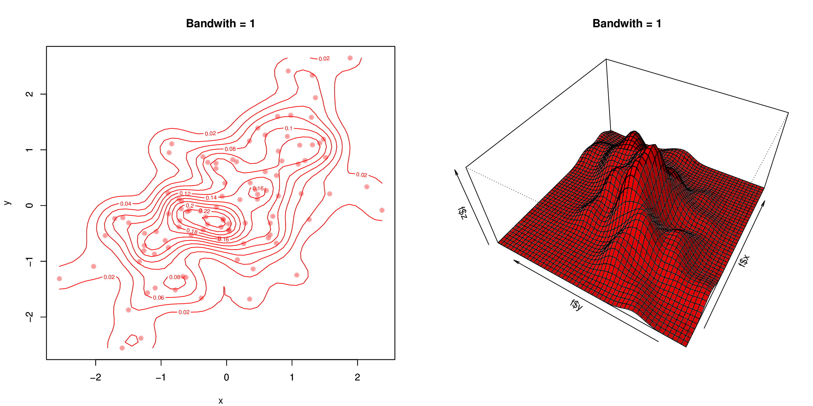

# Animated bivariate kernel density

## Animación do efecto do ancho de banda na estimación de densidade

Eduardo Corbelle Rico, febreiro de 2016

Este proxecto utiliza R para crear unha animación da elección do ancho de banda na estimación de densidade en dúas dimensións.

O ficheiro Diapos.pdf é un exemplo do resultado da animación utilizando LaTeX e beamer. A animación pódese apreciar cando se abre no Acrobat Reader de Adobe.
